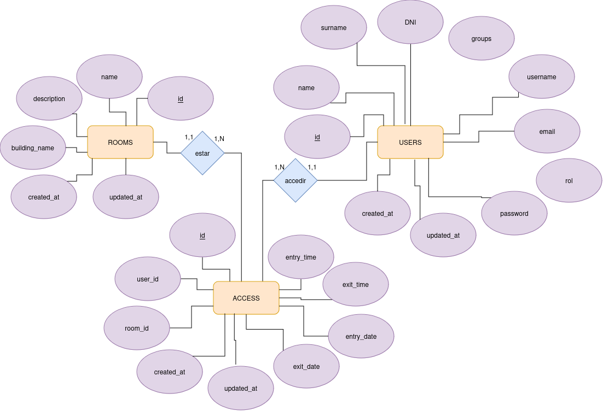

# Model Relacional

## USER
Un **USER** està identificat per un identificador propi, també té un nom i cognom a més del seu nom d'usuari, també té el DNI, mail i contrasenya. També té data de creació i data de modificació.

    USER (id (PK), name, surname, username, DNI, mail, password, created_at, updated_at)

## ROOM
Un **ROOM** està identificat per un identificador propi, també té un nom, descripció i a quin edifici està ubicat. També té data de creació i data de modificació.   

    ROOM(id (PK), name, description, building_name, created_at, updated_at)

## ACCESS
Un **ACCESS** està identificat per un identificador propi, també té el id de l'usuari, el id de la sala, l'hora d'entrada i sortida i la data d'entrada i de sortida. També té data de creació i data de modificació.  

    Concert(id (PK), user_id (FK), room_id (FK), entry_time, exit_time, entry_date, exit_date)
        on user_id Referència USER(id)
        on room_id Referència ROOM(id)

# Model Entitat Relació

